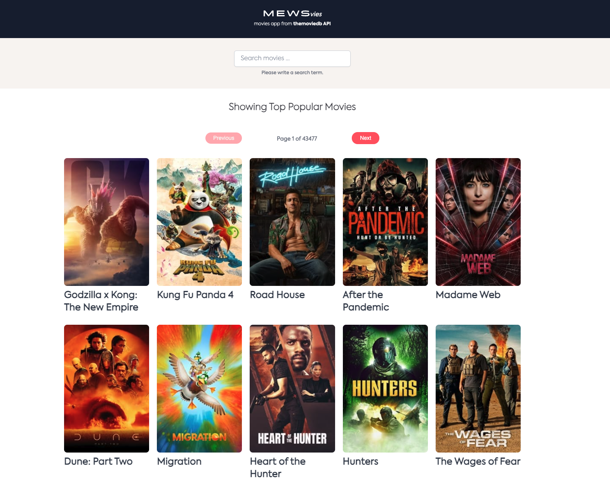

  <h1> MEWSvies - Search Movie App </h1>
    
  
   
   
  
 Final result 

  
<strong> https://mews.vercel.app/ </strong>

   

# Mews frontend developer task

Movie search application. The application will have two views - search and movie detail. The search view is the default view and should contain search input and display a paginated list of found movies with a way to load additional batches. The search should start automatically after typing into the input when finished - there is no need for a search button. Clicking on a movie gets you to the movie detail view, where detailed information about the movie should be listed.

By default, you will see the Top Popular Movies from the API.

## Features

-   [x] TS and React, API rest
-   [x] React custom hooks
-   [x] React Router
-   [x] React Query
-   [x] Functional programming
-   [x] Tailwindcss
-   [x] Styled components
-   [x] UnitTesting
-   [x] Placeholder Images
-   [x] Loader spinner
-   [x] Design system from [https://www.mews.design/latest/welcome-eumfLxWD] (MEWS)

## Available Scripts

Clone the repo, in the project directory, install all the modules and dependencies; you can run:

### `npm i`

Runs the app in the development mode.\
Open [http://localhost:3000](http://localhost:3000) to view it in the browser.

### `npm start`

The page will reload if you make edits.\
You will also see any lint errors in the console.

To run the test and coverage, launch the test runner in the interactive watch mode.\

### `npm test`

To fix all the linter issues and prettier run:

### `npm run lint:fix`

## Project structure

`src/
|
|-- assets/
|   |-- fonts
|   |-- logo
|
|-- components/
|   |-- Footer.tsx
|   |-- Header.tsx
|   |-- Loading.tsx
|   |-- MovieGrid.tsx
|   |-- MovieItem.tsx
|   |-- Pagination.tsx
|   |-- SearchForm.tsx
|
|-- hooks/
|   |-- useFetchMovies.ts
|
|-- interfaces/
|   |-- index.tsx
|
|-- pages/
|   |-- tests/
|       |-- Homepage.test.tsx
|       |-- MovieDetails.test.tsx
|   |-- Homepage.tsx
|   |-- MovieDetails.tsx
|
|-- utils/
|   |-- handleUrl.tsx
|
|-- App.tsx
|-- index.tsx`
