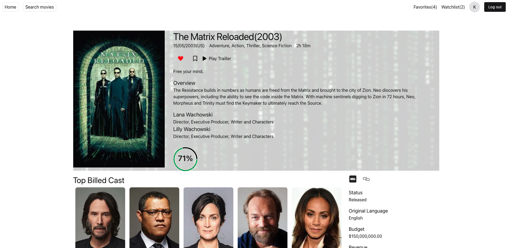
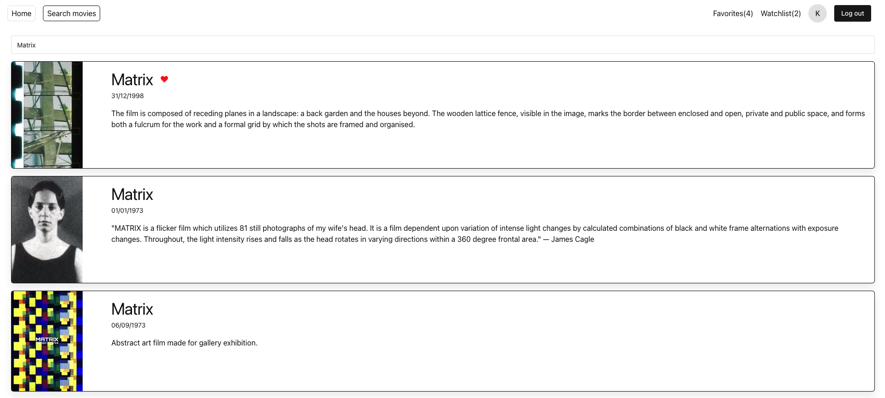

# Movie Search app

React application for searching movies using The Movie DB api.

# Features

- Login
- Search movies: Search movies. Includes pagination.
- Details: Shows details of a movie such as cast, overview, posters, videos, rating, reviews, recommendations.
- Favorite: Favorite a movie using your account.
- Add to watch list: Add a movie to your watchlist using your account.





# Tech Stack

- React
- Typescript
- Tanstack react-router
- Tanstack react-query
- Tanstack react-pacer
- @uidotdev/usehooks
- luxon: for Date
- lodash: to improve functional programming
- Chakra-ui for styling

# Setup

## Add the API_KEY

Create `.env` and add the [API KEY](https://www.themoviedb.org/settings/api) from your account of The Movie DB.

```
VITE_TMDB_API_KEY=<YOUR API KEY>
```

# Development

- Install [nvm](https://github.com/nvm-sh/nvm)
- Run `nvm use`. It will install and switch nodejs to 20.19.5
- npm install
- npm run dev

# Production

## Via Docker

### Build

```
docker build -t movisearchapp .
```

### Run container

```
docker run -p 8080:80 movisearchapp
```

## Via NPM

- Install [nvm](https://github.com/nvm-sh/nvm)
- Run `nvm use`. It will install and switch nodejs to 20.19.5
- npm ci
- npm run build
