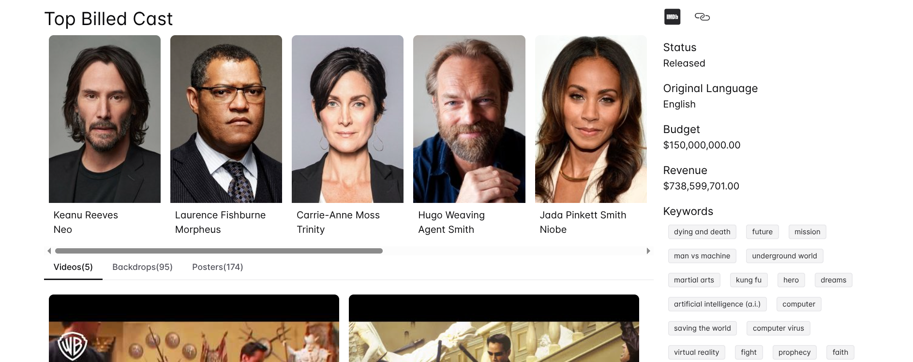

# Movie Search app
React application for searching movies using The Movie DB api.

# Features
- Search: Search movies. Includes pagination.
- Details: Shows details such as cast, overview, posters, videos, rating, reviews, recommendations.
- Favorite: Favorite your movie using your account(provided at API KEY)
- Add to watch list: Add your movie to watch list using your account(provided at API KEY)
- Login: Creates session to allow you favorite and add to watch list.




# Tech Stack
- React
- Typescript
- Tanstack react-router
- Tanstack react-query
- Tanstack react-pacer
- @uidotdev/usehooks
- luxon: for Date
- lodash: to improve functional programming
- Chakra-ui for styling

# Setup
## Add the API_KEY 
Create `.env` and add the [API KEY](https://www.themoviedb.org/settings/api) from your account of The Movie DB.
```
VITE_TMDB_API_KEY=<YOUR API KEY>
```

# Development
- Install [nvm](https://github.com/nvm-sh/nvm)
- Run `nvm use`. It will install and switch nodejs to 20.19.5
- npm install
- npm run dev

# Production
## Via Docker
### Build
```
docker build -t movisearchapp .
```
### Run container
```
docker run -p 8080:80 movisearchapp
```
## Via NPM
- Install [nvm](https://github.com/nvm-sh/nvm)
- Run `nvm use`. It will install and switch nodejs to 20.19.5
- npm ci
- npm run build
