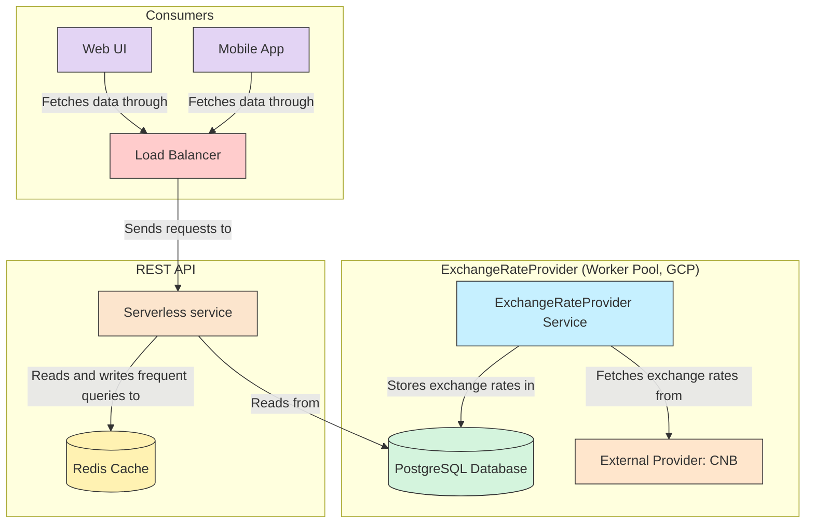
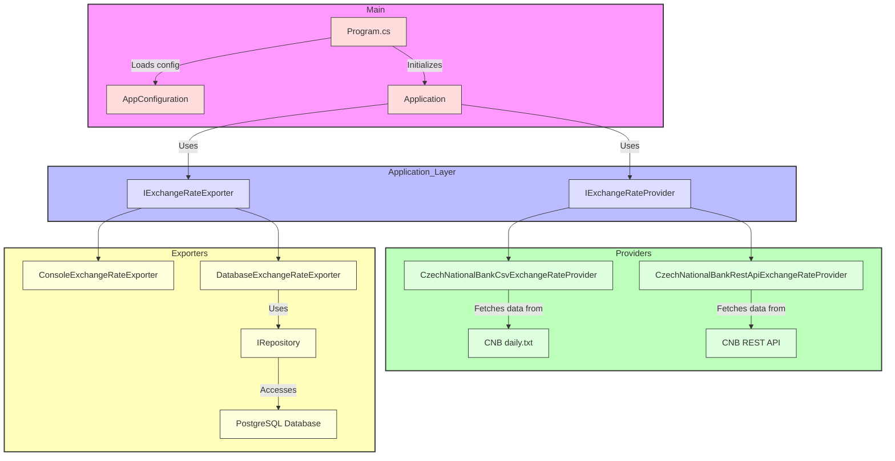

# Mews backend developer task

We are focused on multiple backend frameworks at Mews. Depending on the job position you are applying for, you can
choose among the following:

* [.NET](DotNet.md)
* [Ruby on Rails](RoR.md)

# Assigment - Exchange Rate Updater

A .NET 6.0 console application that fetches exchange rates from external providers and exports them to different
destinations.

## Features

- Pluggable exchange rate providers (CSV or REST)
- Flexible output targets (console or PostgreSQL)
- Container-ready (Docker) for easy deployment.
- Structured logging via Serilog.
- Fully configurable through environment variables.

## Prerequisites

- Docker and Docker Compose in case of running the database locally (a docker-compose.yml file is provided).
- .NET 6.0 SDK (if running locally without Docker)

## Assumptions and comments

### Arquitectura de la solución

Throughout the development process, I made several assumptions and design decisions that I would like to explain below.

At first, I considered building a **REST API** that would directly return exchange rates from a specific provider — for
example, the Czech National Bank. This approach would allow the service to scale efficiently in case of increased **CPU
usage**, **traffic**, or **number of requests**.

However, after analyzing the total number of world currencies — approximately **180**, according to the United Nations —
I decided to implement a **console application running as a scheduled daemon (every 24 hours)**. This application
retrieves exchange rates, processes them, and stores the results in a database. This design ensures that the database
can efficiently handle the expected data volume while supporting queries for conversions between currencies and the
Czech koruna.

So, what about data consumption from the clients?  
This is where the **REST API** comes into play. The console application is responsible for fetching and persisting the
data, while the REST API provides those stored exchange rates to consumers on demand.

This architecture allows the solution to scale horizontally: increasing the number of API instances as needed, and
potentially adding components such as a **load balancer** or **Redis cache** to improve performance — especially given
that currency rates are only updated once per day.

Below is a diagram in mermaid illustrating the proposed solution:



### Code Changes and Architectural Improvements

To enhance **maintainability** and **testability**, I introduced **dependency injection** across the application. This
decouples core logic from implementation details, allowing providers and exporters to be swapped or extended without
modifying the main application code.

I also added **structured logging with Serilog**. Although logs are currently formatted for console readability during
development, the system can easily be configured to output **JSON-structured logs** for cloud deployments and
centralized log aggregation platforms.

Given that the application is intended to run as a **Dockerized service in the cloud**, all configuration values are
managed via **environment variables**. This approach enables seamless configuration across environments without
requiring code changes. Input values are validated to ensure safe and predictable execution.

The application is logically divided into three main layers:

- **Providers** – Retrieve exchange rate data from different external sources.
- **Exporters** – Push processed data to various targets (e.g., database, console, etc.)
- **Application layer** – Coordinates the flow between providers and exporters.

Take a look to the mermaid diagram below for a visual representation of the architecture:



By defining **interfaces** for both providers and exporters, the system supports easy extension — new data sources or
output destinations can be added without modifying existing components.

Additionally, I extended the `ExchangeRate` model to include a **Date** field, since foreign exchange rates are always
tied to a specific timestamp.  
This enhancement enables the future REST API to support **historical queries**, time-range filtering, and the ability to
power **analytics and charting** features based on historical exchange rate data.

## How to run the application

### Configuration

The application is configured through environment variables:

| Variable                     | Description                                              | Default Value           | Example                                                       |
|------------------------------|----------------------------------------------------------|-------------------------|---------------------------------------------------------------|
| `CURRENCIES`                 | Comma-separated list of currencies. Valid ISO 4217 codes | `USD,EUR,GBP`           | `USD,EUR,GBP`                                                 |
| `DATABASE_CONNECTION_STRING` | PostgreSQL connection string                             | *Required - No default* | `Host=localhost:5432;Database=exchange_rates_db;Username=...` |
| `DAILY_RATE_URL`             | URL to fetch exchange rates                              | *Required - No default* | `https://api.cnb.cz`                                          |
| `PROVIDER_TYPE`              | Exchange rate provider to obtain the data                | `CSV`                   | `CSV` or `REST`                                               |
| `EXPORTER_TYPE`              | Output destination for the obtained data                 | `CONSOLE`               | `DATABASE` or `CONSOLE`                                       |
| `LOG_LEVEL`                  | Level of the logging                                     | `DEBUG`                 | `DEBUG`, `INFORMATION`, `WARNING`, `ERROR`, `FATAL`           |

As mentioned earlier, the system currently supports **two provider types** (CSV and REST) and **two exporter types** (
Database and Console).  
By default, the application is configured to use the **CSV provider** and the **Console exporter**, making it simple to
run locally without external dependencies.

Both provider implementations require a **source URL** to retrieve the exchange rate data.  
During development, I used data from the **Czech National Bank** as the reference source. Depending on the selected
provider, the URL must point to an endpoint that returns data in the expected format (CSV or JSON). Below are example
values used for configuration:

- CSV:
  `https://www.cnb.cz/en/financial-markets/foreign-exchange-market/central-bank-exchange-rate-fixing/central-bank-exchange-rate-fixing/daily.txt`
- REST: `https://api.cnb.cz`

### Running the application locally with the IDE

To run the application, simply configure the required environment variables in your IDE and start the program.  
For development purposes, the default exporter is set to **Console**, so the retrieved exchange rates will be printed
directly to the terminal.

### Running with Docker

The following commands build the Docker image and run the container with the required environment variables.  
Make sure to execute them from the **root directory of the project**, where the `Dockerfile` is located.

Below is an example of running the application using the **CSV provider** and exporting results to the **console**:

```bash
docker build . --tag=mews-dleon && docker run --rm -t \
  -e DAILY_RATE_URL="https://www.cnb.cz/en/financial-markets/foreign-exchange-market/central-bank-exchange-rate-fixing/central-bank-exchange-rate-fixing/daily.txt" \
  -e PROVIDER_TYPE="CSV" \
  -e EXPORTER_TYPE="CONSOLE" \
  -e CURRENCIES="USD,EUR,GBP" \
  -e LOG_LEVEL="INFORMATION" mews-dleon
```

Example of running the application to import exchange rates from the **REST API provider** and export them to the *
*console**:

```bash
docker build . --tag=mews-dleon && docker run --rm -t \
  -e DAILY_RATE_URL="https://api.cnb.cz" \
  -e PROVIDER_TYPE="REST" \
  -e EXPORTER_TYPE="CONSOLE" \
  -e CURRENCIES="USD,EUR,GBP" \
  -e LOG_LEVEL="INFORMATION" mews-dleon
```

### Running the database

If you want to run the application using the **DATABASE exporter**, you need a running PostgreSQL instance.  
To simplify the setup, a `docker-compose.yml` file is provided to spin up a local PostgreSQL database.

To start the database, run the following command from the project root:

```bash
docker-compose up
```

This will start the database server and automatically configure it using the initialization script located in
`database-init.sh`. The script creates the required tables, users, permissions, and applies some basic security
configurations.

Once running, the database will be available at `localhost:5432` with the following credentials:

- **Database**: `exchange_rates_db`
- **User**: `db_user`
- **Password**: `123456`

To run the solution using either of the providers and the **DATABASE exporter**, use the following command:

```bash
docker build . --tag=mews-dleon && docker run --rm -t \
  -e DAILY_RATE_URL="https://api.cnb.cz" \
  -e PROVIDER_TYPE="REST" \
  -e EXPORTER_TYPE="DATABASE" \
  -e CURRENCIES="USD,EUR,GBP" \
  -e DATABASE_CONNECTION_STRING="Host=host.docker.internal:5432;Database=exchange_rates_db;Username=db_user;Password=123456" \
  -e LOG_LEVEL="INFORMATION" mews-dleon
```

## Missing features and potential improvements

Due to time constraints, I was not able to implement all the functionalities I would have liked. Below are some
enhancements and additional features that could be implemented in the future:

- **Pipelines** for building and publishing Docker images.
- **Unit and integration tests** to ensure code reliability.
- **Error handling and retries** for network operations.
- Enhanced error handling by using **custom exceptions** instead of the generic `Exception`.
- **Health checks and monitoring** to track the application's status.
- **Security enhancements** for sensitive data handling, such as the database connection string.
- Avoid inserting **duplicate exchange rates** into the database for the same date.
- Prepare the application to run **every 24 hours**, for example by including scheduling code (e.g., Quartz .NET),
  or an endpoint that can be triggered by an external scheduler or even using a Pub/Sub topic.
