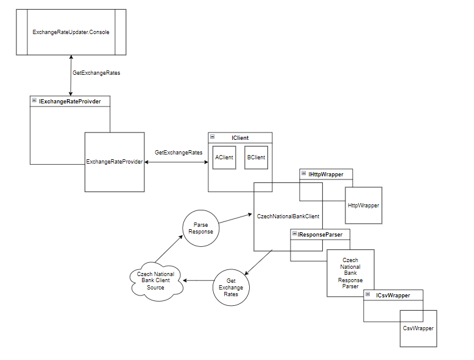

# About
**ExchangeRateUpdater** is a .NET application that was built to complete the mews backend developer task.

# Mews backend developer task

The task was to implement an ExchangeRateProvider for the Czech National Bank (CNB). 
The solution had to be buildable, runnable and the main program should output the obtained exchange rates.
The goal is to implement a fully functional provider, based on real world public data source of the assigned bank.

## Planning
To assist with planning the task, I setup a [GitHub Project board](https://github.com/users/grahamrgriffiths/projects/1/views/1). Usually, I would use Trello - but I've been meaning to try [projects](https://docs.github.com/en/issues/planning-and-tracking-with-projects/learning-about-projects/about-projects)

### ExchangeRateProvider source exploration
Part of the task included finding the data source of the exchange rate data on the CNB website. 

Navigating the site for the CNB led me to [this page](https://www.cnb.cz/en/financial-markets/foreign-exchange-market/)
Where it states the following:

> the Czech National Bank declares the exchange rate of the Czech currency against foreign currencies in the form of central bank exchange rate fixing and in the form FX rates of other currencies.

This presented two choices,
1. Use the source from the [Central bank exchange rate fixing](https://www.cnb.cz/en/financial-markets/foreign-exchange-market/central-bank-exchange-rate-fixing/)
2. Use the source from the [FX rates of other currencies](https://www.cnb.cz/en/financial-markets/foreign-exchange-market/fx-rates-of-other-currencies/)
 
There is a potential third choice here, to aggregate the two sources.

To be sure, I confirmed with a tech lead that choice 1 was correct, and that there was no need to aggregate them for the exercise.

### ExchangeRateProvider data overview 
Now that I had identified the [data source](https://www.cnb.cz/en/financial-markets/foreign-exchange-market/central-bank-exchange-rate-fixing/central-bank-exchange-rate-fixing/daily.txt?date=04.10.2022) - the next step was to examine the format.

**Sample of the data**
```csv
04 Oct 2022 #192
Country|Currency|Amount|Code|Rate
Australia|dollar|1|AUD|16.027
Brazil|real|1|BRL|4.854
Bulgaria|lev|1|BGN|12.548
...
```

**Summary**

This is an easy-to-read CSV format (where the delimiter is a pipe '|'). 

The first row is a date and can be skipped to use the second row as the header.

## Expanding the application
The task contained an initial skeleton for the application. I was allowed to decide which technology (from the .NET family) or package(s) to use.

There was also a requirement to write the code to run on production environment and had to maintain it long-term.

### Architecture
In this version (1.0.0), significant improvements have been made to promote loose coupling, and high cohesion.

The models have been separated from direct implementations; this promotes reusability. The same has been done for constants and enums.
To further promote reusability, the configuration, HTTP, and CSV functionality has been separated into their own implementations. 

The client (in this case, CNB) logic has been separated from the provider logic. This allows us to add more clients at a later date.

The client parsing logic has been separated from the main client implementation. 
This allows us to adjust how the parsing is done (if for example the format changes), without impacting the functionality to fetch the data.



#### Future Considerations 
As the source is updated daily, we could add caching so that we're not calling to the provider each time.
We could also add an API to obtain the rate information, which would include expanding the pipeline to include deployment.

### Third party libraries 
We know that the source data is CSV, so we've made use of the widely adapted [CSV Helper](https://joshclose.github.io/CsvHelper/)

Other libraries have also been used, the dependency check report details these.

## Running the application
To run the application locally, ensure you are in the directory 'jobs\Backend\src\ExchangeRateUpdater.Console'

First, restore the dependencies.
```
dotnet restore
```

Second, build the project,
```
dotnet build
```

Finally, run the project.
```
dotnet run
```

For production, use
```
dotnet run --launch-profile Production
```

## Testing the application
Partial test coverage has been introduced for the Provider, Client, Parsing and CSV functionality.
To test the application locally, ensure you are in the directory 'jobs\Backend\src'

Run the tests
```
dotnet test
```

Generate a test report (with coverage)
```
dotnet test --settings settings/coverlet-run.xml --logger trx --results-directory "reports"
```

## CI 
A CI pipeline has been implemented for this task using Github Actions.

The pipeline has the following workflows:
- ExchangeRateUpdater CI
    - Builds the application.
    - Tests the application. 
        - Generates a report, with coverage.
    - Runs OWASP dependency check.
    - Runs Code QL analysis.

[](https://github.com/grahamrgriffiths/ExchangeRateProvider/actions/workflows/ExchangeRateUpdater.yml)


## Author
[Graham Griffiths](https://github.com/grahamrgriffiths)
