# Architecture

## Overview

The Exchange Rate Provider is built using Clean Architecture principles to ensure separation of concerns, testability, and maintainability. The architecture is divided into multiple layers, each with specific responsibilities and dependencies.

## Architectural Diagrams

### Clean Architecture Layers

```mermaid
graph TD
    %% Presentation Layer (Outer)
    A[Presentation Layer<br/>🌐 Entry Points<br/>├── <b>ExchangeRateProvider.Api</b><br/>│   ├── REST Controllers<br/>│   ├── Swagger/OpenAPI<br/>│   └── Health Monitoring<br/>└── <b>ExchangeRateProvider.Console</b><br/>    └── CLI Interface]

    %% Application Layer
    B[Application Layer<br/>⚙️ Use Cases & Business Logic<br/>├── MediatR CQRS Pipeline<br/>├── GetExchangeRatesQuery<br/>├── Query Handlers<br/>└── Dependency Injection]

    %% Domain Layer (Core)
    C[Domain Layer<br/>🎯 Core Business Rules<br/>├── <b>Entities</b><br/>│   ├── Currency<br/>│   └── ExchangeRate<br/>├── <b>Interfaces</b><br/>│   ├── IExchangeRateProvider<br/>│   └── IProviderRegistry<br/>└── Business Logic]

    %% Infrastructure Layer
    D[Infrastructure Layer<br/>🔧 External Concerns<br/>├── CnbExchangeRateProvider<br/>├── Intelligent Caching<br/>├── Distributed Cache<br/>├── Resilience Policies<br/>└── Service Registration]

    %% External Systems
    E[External Systems<br/>🌍 Third-Party Services<br/>├── CNB API<br/>├── Redis Cache<br/>└── Docker Runtime]

    %% Dependencies (Outer layers depend on inner layers)
    A -->|depends on| B
    B -->|depends on| C
    D -->|depends on| C
    D -->|integrates with| E

    %% Enhanced Styling - Beautiful, eye-friendly colors
    style C fill:#e3f2fd,stroke:#1976d2,stroke-width:4px,color:#0d47a1
    style B fill:#f3e5f5,stroke:#7b1fa2,stroke-width:3px,color:#4a148c
    style A fill:#fff8e1,stroke:#f57c00,stroke-width:2px,color:#e65100
    style D fill:#e8f5e8,stroke:#388e3c,stroke-width:2px,color:#1b5e20
    style E fill:#f5f5f5,stroke:#757575,stroke-width:1px,color:#424242
```

### Data Flow Diagram

## Layer Descriptions

### Domain Layer
- **Purpose**: Contains core business entities, value objects, and interfaces
- **Components**:
  - `Currency` and `ExchangeRate` entities with validation
  - `IExchangeRateProvider` interface for provider abstraction
  - `IProviderRegistry` for managing multiple providers
- **Dependencies**: None (innermost layer)

### Application Layer
- **Purpose**: Contains business logic and use cases
- **Components**:
  - MediatR-based command/query pattern
  - `GetExchangeRatesQuery` and handler for rate retrieval
- **Dependencies**: Domain Layer

### Infrastructure Layer
- **Purpose**: Handles external concerns and implementations
- **Components**:
  - `CnbExchangeRateProvider`: CNB API integration
  - `CnbCacheStrategy`: Intelligent caching based on CNB publication schedule
  - `DistributedCachingExchangeRateProvider`: Redis-based caching decorator
  - Polly policies for resilience (retry, circuit breaker)
  - Provider registration services
- **Dependencies**: Domain Layer

### Presentation Layer
- **Purpose**: Entry points for the application
- **Components**:
  - **API Layer** (`ExchangeRateProvider.Api`): ASP.NET Core RESTful web API with controllers, Swagger, health checks
  - **Console Layer** (`ExchangeRateProvider.Console`): Command-line interface for testing
- **Dependencies**: Application Layer

## Key Architectural Decisions

### 1. Clean Architecture
**Decision**: Implement Clean Architecture with strict layer separation.
**Rationale**:
- Ensures separation of concerns
- Improves testability by allowing mocking of dependencies
- Facilitates maintainability and evolution of the codebase
- Prevents business logic from being coupled to external frameworks

### 2. Provider Abstraction Pattern
**Decision**: Use `IExchangeRateProvider` interface with priority-based provider registry.
**Rationale**:
- Allows easy addition of new exchange rate providers
- Enables fallback mechanisms if primary provider fails
- Supports different providers for different currencies or regions
- Maintains single responsibility principle

### 3. Intelligent Caching Strategy
**Decision**: Implement time-based caching that adapts to CNB publication schedule.
**Rationale**:
- Reduces unnecessary API calls to CNB
- Optimizes performance during high-frequency publication windows
- Balances freshness of data with system performance
- Reduces load on external API

### 4. CQRS with MediatR
**Decision**: Use MediatR for implementing CQRS pattern in the Application layer.
**Rationale**:
- Separates read and write operations
- Improves code organization and maintainability
- Enables easy testing of handlers
- Supports cross-cutting concerns like logging and validation

### 5. Resilience with Polly
**Decision**: Implement Polly policies for retry, circuit breaker, and timeout.
**Rationale**:
- Handles transient failures gracefully
- Prevents cascading failures
- Improves system reliability and user experience
- Provides configurable resilience strategies

### 6. Distributed Caching with Redis
**Decision**: Use Redis for distributed caching in multi-instance deployments.
**Rationale**:
- Enables cache sharing across multiple application instances
- Improves performance in scaled environments
- Provides persistence and backup capabilities
- Integrates well with cloud deployments

### 7. Docker Containerization
**Decision**: Provide multi-stage Dockerfiles for development and production.
**Rationale**:
- Ensures consistent deployment across environments
- Simplifies scaling and orchestration
- Improves development workflow
- Enables efficient CI/CD pipelines

### 8. Comprehensive Testing Strategy
**Decision**: Maintain high test coverage with unit, integration, and infrastructure tests.
**Rationale**:
- Ensures code quality and prevents regressions
- Enables confident refactoring and feature additions
- Validates integration with external services
- Supports continuous integration practices

## Data Flow

1. **API Request**: Client sends request to `/api/exchange-rates`
2. **Controller**: `ExchangeRatesController` receives request and validates input
3. **Application**: `GetExchangeRatesQuery` is sent via MediatR
4. **Handler**: `GetExchangeRatesQueryHandler` processes the query
5. **Infrastructure**: Provider registry selects appropriate provider
6. **Caching**: Cache strategy checks for cached data
7. **Provider**: If cache miss, fetches data from CNB API
8. **Response**: Data flows back through layers to client

## Production Features

### Implemented Features
- ✅ **Rate Limiting**: ASP.NET Core Rate Limiting
- ✅ **Health Checks**
- ✅ **Prometheus Metrics**: Request counts, response times, cache hit rates
- ✅ **Swagger/OpenAPI**: Interactive API documentation
- ✅ **Circuit Breaker**: Automatic failure detection and recovery using Polly
- ✅ **Retry Policies**: Exponential backoff for transient failures
- ✅ **Distributed Caching**: Redis support for multi-instance deployments
- ✅ **Docker Support**: Production-ready containerization

### Security Considerations
- Input validation for currency codes
- Rate limiting to prevent abuse
- Secure defaults for Redis configuration

### Monitoring and Observability
- Health endpoints for load balancer checks
- Prometheus metrics for alerting
- Structured logging with Serilog
- Request tracing and correlation IDs

## Deployment Architecture

The application supports multiple deployment scenarios:

- **Development**: Local Docker Compose with Redis
- **Production**: Containerized deployment with external Redis
- **Console**: Standalone executable for batch operations
