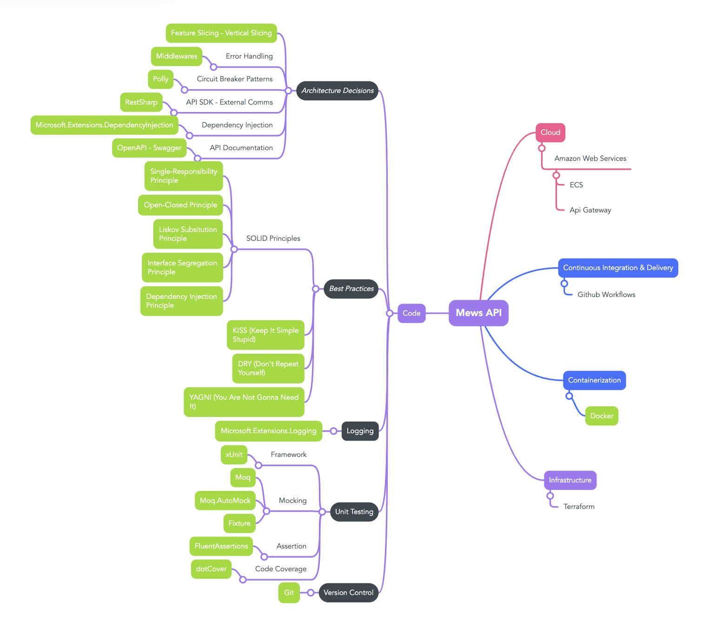
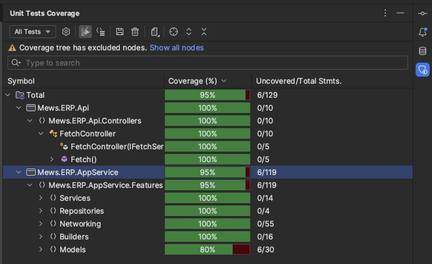

# Mews Exchange Rate Providers Test

## Summary

This exercise's goal is to provide a quick, easy and 'production like' way to integrate the Czech National Bank API. Aiming to obtain the daily exchange rate values from the mentioned bank and then map them against the currencies that we support "internally".

## Solution Overview

## Technical Documentation
### Architecture Decisions
#### Feature Slicing - Vertical Slicing
When thinking of the architecture of the solution I went with a Feature-Slice technique where all the logic is divided into separate "Features" located in the Mews.ERP.AppService project.

In this project we will find all the classes, interfaces, structs, etc. that will be used to contain all the "business" logic of the program.

When thinking of the folder structure, I always try to provide with a clean and easy way of exploring through the solution.
In the project we can find the following:
- Data
  - Here we can find (and would find) all the classes associated to the database setup, database model and extension methods needed.
  - At this time we can only see the IReadOnlyRepository and ReadOnlyRepository files
    - The aim of this interface and class is to implement the repository pattern with readonly behavior ONLY since we do not need anything else **for the time being (YAGNI)**.
    - In case we need more granular methods like GetById we would add them here.
    - In case we need write methods, we would implement a separate interface which will define the contract for said behavior.
  - The database context would be inside this folder.
  - The migrations would be inside this folder.
- Features
  - Here we can find all the classes/interfaces/structs/etc related to the BUSINESS FEATURES that will be delivered.
  - We can find 2 features: Fetch and Startup
    - Fetch
      - In this feature we can find all the logic to fetch the exchange rates and filter them based on the currencies that we store in our internal "database".
      - Due to time limitations I mocked the currencies so as to avoid the effort of setting up a local database and installing the necessary dependencies (db engine, running migrations, etc.).
        - This would have been "the next thing to do". Implement an InMemory database with static data (or a "Feed" feature that would feed said database).
        - **Note**: I said InMemory database due to the same reason, this is an exercise. In reality in the **ONLY** scenario that I would use an InMemory database would be for unit testing.
- Shared
  - In this folder we can find all classes/interfaces that are used across the whole project (not only features).
  - For example, here we have the Middleware class to support global error handling.

Also, each feature is responsible for its own dependency injection, that's why we can find a "ServiceCollectionExtensions" class inside each Feature folder. Since each deliverable is completely independent and isolated (or should be at least), none other should know which classes to inject.

#### Error Handling

I implemented an "ERPMiddleware" for global error handling. Basically if an exception occurs during execution, it will be caught by the middleware and handled accordingly.
In this project and since this is only a test, the only thing we do is logging an error with the exception.
But in reality, we can define a different strategy for global error handling such as notifying a service that an error occurred or if we use a monitoring tool (like Datadog for example) we can push a metric into the cloud provider so that we can trace it and see it in Datadog.

#### Circuit Breaker Patterns
When dealing with an external provider such as the Czech National Bank we CANNOT ensure 100% time of availability, therefore I implemented a retry mechanism using Polly so that in case the first request that we make to the CNB dailyExchangeRates api FAILS, we can retry (x amount of times) and succesfully retrieve the data that we need.

#### API SDK - External Communication
For simplicity purposes I decided to use RestSharp for http communication. 
This library is very useful when dealing with Http communication since it provides an interface IRestClient and class RestClient that provide all the necessary behavior for dealing with http calls to external providers.
Also IRestClient enhances unit testability since mocking HttpClients always tend to be a little bit tricky. With this library we won't have this problem since we can mock the IRestClient interface and setup the desired responses for each test scenario.

### Coding Best Practices
When coding I tried to respect my normal day to day thought process and practices. I tried following SOLID, KISS, DRY and YAGNI practices throughout the project.

Moreover, when defining variables I usually try to be very pragmatic and descriptive so that when reading the code is as easy and understandable as possible.

#### SOLID
- Single Responsibility Principle
  - Classes should be responsible of a "single" thing or have a single purpose in a program.
  - In my opinion one of the most important of the 5 principles, I tried to apply this not only at a class level but also at a method level. Each method needs to do only ONE thing and ONE thing only.
- Open-Closed Principle
  - Classes should be Open for extension and Closed for modification. Basically means adding new functionality without modifying the existing code.
- Liskov Substitution Principle
  - Objects of a superclass should be replaceable with objects of its subclasses without breaking the application.
- Interface Segregation Principle
  - Clients should never be forced to implement an interface that it doesn't use or need. Moreover, clients shouldn't be forced to implement/depend on methods they do not use.
  - Therefore, segregate contracts in as many interfaces as you can so that classes can implement the interfaces they need **ONLY**.
- Dependency Injection Principle
  - Separate the concerns of constructing objects and using them. What this means is that the class should not be responsible of instantiating the dependencies they need to use.
  - In my opinion the most important principle, because it helps decoupling high-level and low-level modules, making it easier to change the low-level ones without affecting the others.

### Logging

#### Framework

I chose the Microsoft.Extensions.Logging library for this project due to its simplicity and quick integration. It's very easy to setup and its already integrated with the base API when creating a new project.
In a real case scenario where I would have had to deploy my API into AWS for example and where I would have wanted to trace my services with higher detail (with Datadog) maybe I would have considered implementing Serilog due to its integration with CloudWatch and with Datadog tracing. 

### Testing

#### Framework

The selected framework was xUnit simply because of its flexibility and extensibility.

#### Mocking

For mocking and setting up my tests I chose **Moq, Moq.AutoMock and Fixture** libraries. With these it's very easy to setup, mock and arrange tests and dependencies. Also, AutoMock provides a way of verifying your methods and execution so you can control and ensure that the logic of your methods behaves as expected.

#### Assertion

For asserting I always use the FluentAssertions library. This library provides classes and methods to assert that your result returns the expected result in a "very easy to read" way. Tests are easier to maintain, to write and to understand. 

#### Code Coverage

For this test I used dotCover to track and measure code coverage. This tool is a Rider extension provided by JetBrains (creator of ReSharper) which allows you to track and measure the coverage you currently have over your program.

In my day to day I use Sonarqube for Code and coverage analysis. Very recommended tool for adding an automated way of controlling and ensuring clean code and high code coverage throughout your solutions. Also, its very easy to integrate Sonarqube with your build and test pipelines in order to prevent any merge that may violate the team's coding rules.

### Containerization

I defined a very simple Dockerfile so that this API can be deployed quickly and in basically any computer (only requirement is to have docker installed :)).

### Continuous Integration & Delivery

For timing purposes I couldn't create a

## How to run the api:

Basically there are two ways of running the api:
* Hosting and running the api in a docker container
* Running the solution manually

With docker:
* Open your terminal (windows terminal, git bash, iTerm (mac))
* Change directory to the following path from the git repo: /Task/src/Mews.ERP
* Run the following docker command:

      docker build -f Mews.ERP.Api/Dockerfile -t mews/exchange-rates-provider .

* The command should run without errors and the image should be created successfully
* Run the following command:
   
      docker image list

      You should see the mews/exchange-rates-provider image created.

* Next, run the following docker command to run the image and create the container: 
  
        docker run -it --rm -p 5050:5050 mews/exchange-rates-provider --name mews.erp.api

* The command should run without errors and create a container for it.
* To check the container was successfully created run the following command:

        docker ps 
        
        You should see a list with all of your running containers containing a 'running container' for your mews/exchange-rates-provider image.

## Next steps or missing features due to not enough time (out of MVP):

## Scalability upgrades