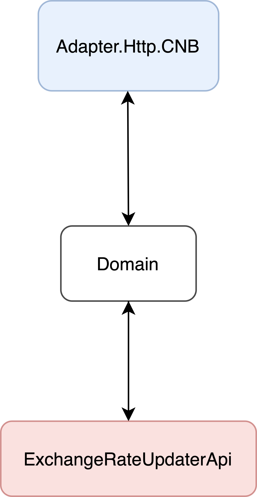

# Mews Assignment - Exchange Rate Updater

## Approach: 
The goal of this assignment is to create a service to get daily exchange rates.

## Features:
- Swagger, to make requests and document the API.
- Polly, to implement a retry policy on the HTTP requests to the CNB API.
- Serilog for logging.
- Unit tests to test the domain logic.
- Integration tests to test the CNB adapter.
- The project was developed following the [Ports and Adapters architecture](https://alistair.cockburn.us/hexagonal-architecture/).

## Structure:
The solution is structured as follows:

    

- The **ExchangeRateUpdaterApi** corresponds to the host. It builds the application and has the API controller.
- The **Domain** holds all the domain logic for the service. 
- The **Adapter.Http.CNB** implements the `ExchangeRatesRepository` which makes HTTP requests to the CNB API.

Additionally, the solution has 3 more projects:
- **ExchangeRateUpdaterApi.Tests.Unit** which tests the host and the domain logic using an in-memory adapter.
- **Adapter.Http.CNB.Tests.Integration** which tests the CNB API.
- **Adapter.InMemory** which holds an in-memory implementation of the `ExchangeRatesRepository` for unit testing purposes.

## Future Improvements:
- Create a client for the CNB API.
- Add more Polly policies.
- Add more tests.
