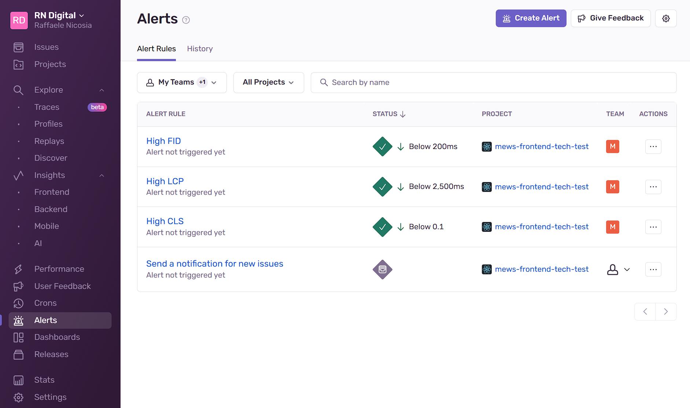

# MEWS Front-End Tech Test

## Running the App

1. Install the dependencies:
   ```bash
   npm i
   ```
2. To run the App:
   ```bash
   npm run dev
   ```

## Testing the App

Testing React components is crucial to ensure the reliability, maintainability, and scalability of your application. It helps identify bugs early, ensures component behavior under various scenarios, and facilitates safe refactoring. With tools like Vitest, you can efficiently test components to prevent regressions, improve code quality, and boost confidence in your codebase.

1. To run Unit and Integration tests:
   ```bash
   npm run test
   ```

## Linting and Formatting

This project is configured with **ESLint** and **Prettier** to ensure code quality and consistency throughout the codebase.

### Benefits

- Early detection of potential issues during development.
- Enforced coding standards across the team.
- Consistently formatted code, improving readability and maintainability.

### Running Lint Checks

1. To run lint checks:
   ```bash
   npm run lint
   ```

### Running Formatting

1. To format:
   `bash
npm run format
 `
   It is recommended to enable automatic formatting on save in your code editor to ensure consistent code formatting.

## Error & Performance Monitoring

Monitoring performance and error metrics in web applications is essential for ensuring a great user experience, maintaining reliability, and supporting business goals. It helps diagnose issues, optimize performance, and proactively resolve problems before they impact users. Key metrics like load times, error rates, and crash reports provide actionable insights, enabling scalability, reducing downtime, and enhancing maintainability.

This is where [Sentry](https://sentry.io/welcome/) comes in help and I have configured it to capture errors and performance metrics for the frontend application.
The configuration is located in the `sentryConfig.ts` file, while alerts for web performance metrics within the tool alerts panel as shown below (the deprecated [FID](https://web.dev/articles/fid) metric was used instead of the new [INP](https://web.dev/articles/inp) because somehow Sentry has not updated the selectable alert options yet).

## 

## API

The App uses the [The Movie DB API](https://developers.themoviedb.org/3/getting-started/introduction) to retrieve movie information. You can use this API Key to authorize requests:

```
03b8572954325680265531140190fd2a
```

It is recommended to add the API Key as an environment variable `.env` to the frontend application with the following key: `VITE_API_KEY`.
Alternatively you can add the API Key to the `movieClient.ts` file.

```
const apiKey: string = import.meta.env.VITE_API_KEY || '[API_KEY_HERE]'
```

---

### Made with 💓 by Raffaele Nicosia

---

## Original Assignment

You should start with creating a fork of the repository. When you're finished with the task, you should create a pull request.

Your task will be to create a simple movie search application. The application will have 2 views - search and movie detail. The search view is the default view, and should contain search input and display paginated list of found movies with a way to load additional batch. Search should start automatically after typing into the input is finished - there is no need for a search button. Clicking on a movie gets you to the movie detail view where detailed information about the movie should be listed.

To retrieve information about movies, use [TheMovieDb API](https://developers.themoviedb.org/3/getting-started/introduction). You can use our api key to authorize requests:

```
03b8572954325680265531140190fd2a
```

## Required technologies

To test your proficiency with the technologies we use the most, we require the solution to be written in React and TypeScript.
We use styled-components as our main CSS-in-JS framework, yet feel free to use other solutions you are more familiar with.
The use of any additional library is allowed and up to you.
