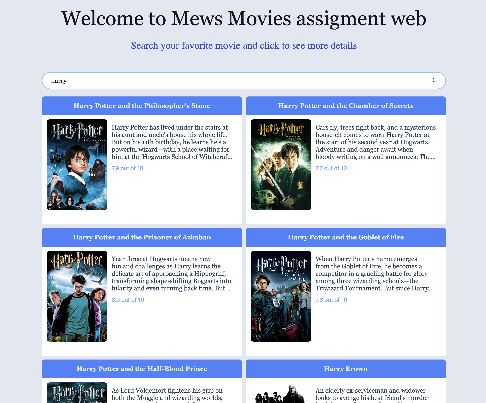
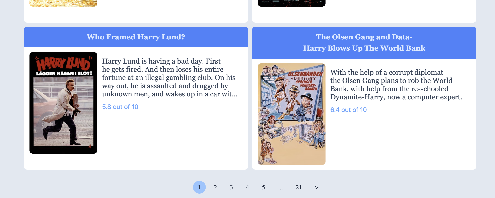
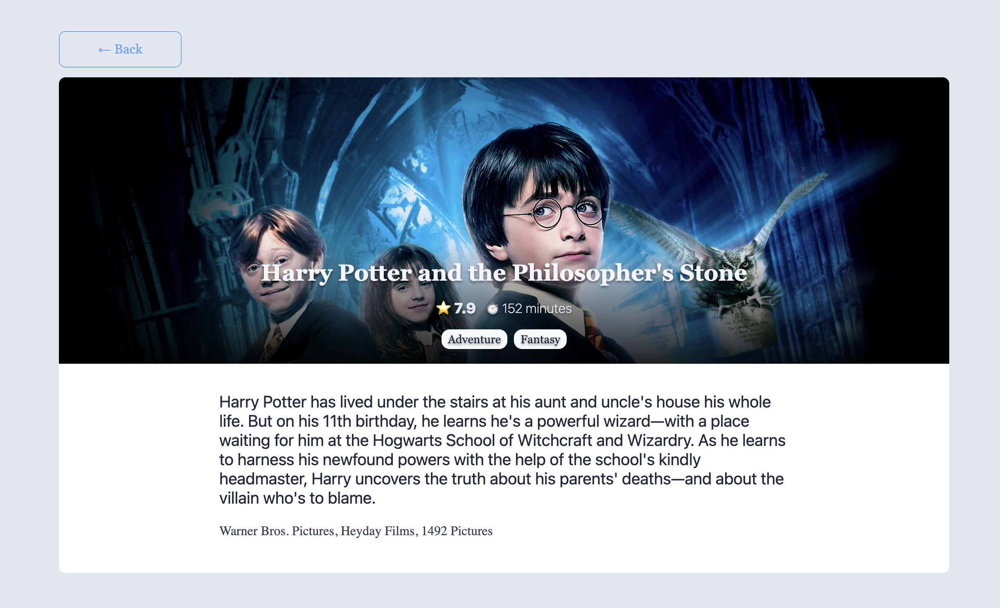

# Mews frontend developer task

Create a simple movie search application. The application will have 2 views - search and movie detail. The search view is the default view, and should contain search input and display paginated list of found movies with a way to load additional batch. Search should start automatically after typing into the input is finished - there is no need for a search button. Clicking on a movie gets you to the movie detail view where detailed information about the movie should be listed.

To retrieve information about movies, use [TheMovieDb API](https://developers.themoviedb.org/3/getting-started/introduction). You can use our api key to authorize requests:

```
03b8572954325680265531140190fd2a
```

## How to run it?

This project use `pnpm` as package manager, os you have to [install](https://pnpm.io/installation) it if you don't have it yet.

Open a terminal in the root folder of this project and run:

`pnpm i`

If all went correctly you are ready to run the app.

### Run the app

Open a terminal in the root folder of this project and run:

`pnpm run dev`

In the output of the terminal you will find in which port the app will be available.

### Run the tests

For the unit tests:

`pnpm run test` and `pnpm run test:coverage` to check the coverage.

For the e2e tests:

`pnpm run test:e2e`

## Dev Diary

In this section you will find a track of all the things that I take into account during the development of this assignment like project setup, challenges, iterations, etc.

### Project setup

After reading the whole assignment a few times I had a better overall idea of what it is needed to be done and take into account the different libs and packages that are suggested in the different Readme file provided.

With all that in mind I decided to use [vite](https://vitejs.dev/) to create a React/Typescript project, since this is quite simple and fast to prototype and app.

But this isn't sufficient to create all the requirements it is because of that that I choose the following packages:

- [styled-components](https://styled-components.com/) CSS in JS lib, recommended by the Readme.
- [@tanstack/react-query](https://tanstack.com/query/latest) Powerful asynchronous state management for TS/JS. Also mentioned in the Readme.
- [@tanstack/react-router](https://tanstack.com/router/latest) From the creator of ReactQuery, support folder and code routing and full typed router, also combine quite well with ReactRouter even if it is not needed.
- [zod](https://zod.dev/) TypeScript-first schema validation with static type inference. Used for the search params validations.
- [vitest](https://vitest.dev/) for testing, same api as Jest but faster.
- [@testing-library](https://testing-library.com/) Simple and complete testing utilities than combine pretty well with React.
- [factory.ts](https://github.com/willryan/factory.ts) to create test object mocks.
- [playwright](https://playwright.dev/) for e2e testing.

### How I intended to solve this challenge?

So far I will divide the problem the following way:

- Setup router and all needed routes.
- Create service layer that will fetch the required data for each route.
- Create search input and integrate it to the home page.
- Create movie card component and use it to display the results of the search in the home page.
- Create pagination component and use it on the home page.
- Create movie detail component and use it on the movie detail page.

### Extra notes

I tried to cover multiple aspect of a web app although not all of them are production ready, I would rather show you multiple aspects of the development that going deeper into just one of it, so you can see multiple aspects of it. A case of this will be for unit tests, I didn't spend any time on the route part since I know I will validate those on the e2e tests.

### Some screenshots

 Home page

 Pagination

 Movie page
