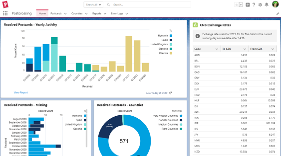

# CNB Exchange Rates Salesforce App
The **cnbexrates** unlocked package version 0.1 (Beta 1) includes a Lightning Web Component bundle fetching and displaying the latest exchange rates from the Czech National Bank. 

## Installation
You can install the unlocked package in your org via the UI by clicking on the following installation links:
- [Production and Developer Orgs](https://login.salesforce.com/packaging/installPackage.apexp?p0=04t7R000000AhANQA0)
- [Sandboxes](https://test.salesforce.com/packaging/installPackage.apexp?p0=04t7R000000AhANQA0)

Alternatively, you can install by running the command:

```sf package install --package 04t7R000000AhANQA0 --target-org username_or_alias```

## Adding the Component to Pages
Simply drag and drop the **CNB Exchange Rates** component onto any Lightning page -- Home, App, Record, or Community.

Example placement:

